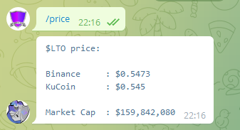
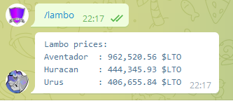
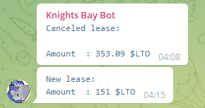
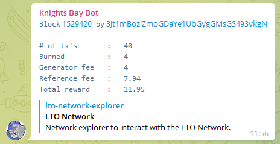

# Knights' Bay Bot
This repository holds the ```docker-compose.yml``` used to run the [Knights' Bay Bot](https://github.com/murmeel/KnightsBayBot) for LTO node operators.
The can currently do 3 things:
1. Respond to ```/price``` and respond with the current LTO token price (<b>heavily</b> inspired by the LTO Edge Bot, cred to @Michaelvg, it's creator).
2. Respond to ```/lambo``` and display the prices of different lambos in $LTO
3. Post information automatically to your Telegram groups whenever your node(s) builds a block, gets a new lease, or gets a lease canceled.

### Example messages
```/price```:

 

```/lambo```:



```Lease info:```



```Block info```



## Installing
In order for the bot to work, you have to create your own bot using [The BotFather](https://t.me/botfather) and then have the ```docker-compose.yml``` file on the machine that's going to run your bot.

### Creating your own bot
1. Start a conversation with The BotFather and create a bot of your own. You can name it whatever you want (within the BotFather rules, of course), give it any profile picture and description/bio. 
2. After creating a bot, you can ask The BotFather for your bot's token. This is a security token that you need in order to control your bot. Keep this safe.
3. You also need to edit your bots settings through the BotFather. You do this by selecting your bot while talking to him, then choose "Bot Settings", then click "Allow Groups?" and turn groups on.
4. Now you need to know the Chat ID of the groups/chats you want the bot to post info to. The easiest way to get this, is to add the Get ID's Bot to your group:
    - Go to your group, click the 3 dots up top, and click "Add members"
    - Search for ```@getidsbot``` and add it to your group.
    - Once added, it should automatically send a message in the group with a bunch of info, including the Chat ID (should start with "-1..." if it's a group).
    - Take that Chat ID and save it, then kick the bot from the group and remove the messages.
5. Now that we have the bot token, and the Chat Id, we can start editing the ```docker-compose.yml``` file.

### Editing the ```docker-compose.yml```
The ```docker-compose.yml``` file is meant to be as easy as possible to manage. All your settings for your bot should be done in this file. This file can be pulled from here, or you could create your own ```docker-compose.yml``` file and paste in the contents and edit the values.
Keep in mind that indentation and spacing matters in this file! So when adding/editing the lines, make sure the spacing an indentation is kept the way it is.
1. First we declare what services we want to start. In this case, we only want to start our bot, but in some cases there are other services you'd want to start. The service can be named anything, but default is ```kbbot```.
2. Next we have the ```container_name:```, which names the container that docker starts. This can also be named whatever you want.
3. Next is the ```image:```. This specifies what image to use, stored in the docker hub. This <b>has to be</b> ```murmeel/knights-bay-bot:latest```.
4. Lastly, we have the ```environment:```. Here goes all the settings for your bot.
    
    A quick note - multiple nodes can be specified to be monitored. They are specified uniquely by increasing the number after ```MonitoredNodes__``` (starting at 0).
    This is also true for the chat ids, where you specify each chat id uniquely by increasing the number after ```ChatIdsToPostTo__``` (starting at 0). 
    
    
    | Setting name | Description |
    |:-|:-|
    |```Bot__Token=```|your bot token goes here|
    |```Bot__MonitoredNodes__0__Address=```|your first (maybe only) LTO node address|
    |```Bot__MonitoredNodes__0__ChatIdsToPostTo__0=```|chat id the bot should post block and lease info to, related to the specified (0) node|
    |```Bot__MonitoredNodes__0__ChatIdsToPostTo__1=```|<b>another</b> chat id the bot should post info to, related to the specified (0) node|
    |```Bot__MonitoredNodes__1__Address=```|your <b>second</b> (if you have it) LTO node address|
    |```Bot__MonitoredNodes__1__ChatIdsToPostTo__0=```|chat id the bot should post block and lease info to, related to the specified (1) node|
    |```Bot__MonitoredNodes__0__PostStartedLease=```|if you want the bot to post when a new lease is started for the specified (0) node ```(default=true)```|
    |```Bot__MonitoredNodes__0__PostCanceledLease=```|if you want the bot to post when a lease is canceled for the specified (0) node ```(default=false)```|
    |```Network__Lto__ApiUri=```|points to mainnet or testnet api ```(default=https://nodes.lto.network/)```|
    |```Serilog__MinimumLevel__Default=```|what log level to use ```(default=Information)```|
    |```Serilog__WriteTo__0__Args__path=```|sets where the log gets stored ```(default=Logs/log.txt)```|
    
    In this way, you can monitor any amount of nodes, and have the bot post to any amount of chats related to that node.
    
That covers the basic settings, and with that, your bot should be all ready to go. When added to your group, it will only respond to the ```/price``` and ```/lambo``` messages, nothing else (also works if you message the bot directly).

### Obtaining api key for market cap
The bot should work fine without anything else, but if you want the bot to include the market cap of LTO, you need to obtain a CoinMarketCap api key (pretty simple):
1. Go to [coinmarketcap.com/api](https://coinmarketcap.com/api/)
2. Click "Get your API key now".
3. Sign up (if you don't already have an account).
4. Follow the steps to get the api key (should be available immediately).

After that, just add the key to the ```docker-compose.yml``` file:
    - ```Network__CoinMarketCap__ApiKey=ApiKeyGoesHere```

Done! Your ```docker-compose.yml``` file should look something like this:

```yaml
services:
  kbbot:
    container_name: knights-bay-bot
    image: murmeel/knights-bay-bot:latest
    environment:
      - Bot__Token=somenumbers:morenumbersandletters_andmore
      - Bot__MonitoredNodes__0__Address=3Jt1mBoziZmoGDaYe1UbGygGMsGS493vkgN
      - Bot__MonitoredNodes__0__ChatIdsToPostTo__0=numbersofchatid
      - Bot__MonitoredNodes__0__ChatIdsToPostTo__1=anotherchatid
      - Bot__MonitoredNodes__0__PostStartedLease=true
      - Bot__MonitoredNodes__0__PostCanceledLease=true
      - Network__Lto__ApiUri=https://nodes.lto.network/
      - Network__CoinMarketCap__ApiKey=numbersand-lettersand-somemorenumbers-andletters
      - Serilog__MinimumLevel__Default=Information
      - Serilog__WriteTo__0__Args__path=Logs/log.txt
```

## Development
Development of this bot is ongoing, and if you have suggestions/bugfixes you can open an issue or a PR over at [KnightsBayBot](https://github.com/murmeel/KnightsBayBot).
